# Install Ubuntu Cloud-init on Proxmox VE 8.1.4

## 📘 Panduan Lengkap


***

## ⚙️ Persiapan

### Upload atau Download File IMG ke Proxmox

- **Ubuntu Server 22.04 IMG:** `jammy-server-cloudimg-amd64.img`
- Upload/Download file ke: **local → ISO Images**

<details>
<summary>Klik untuk menampilkan</summary>

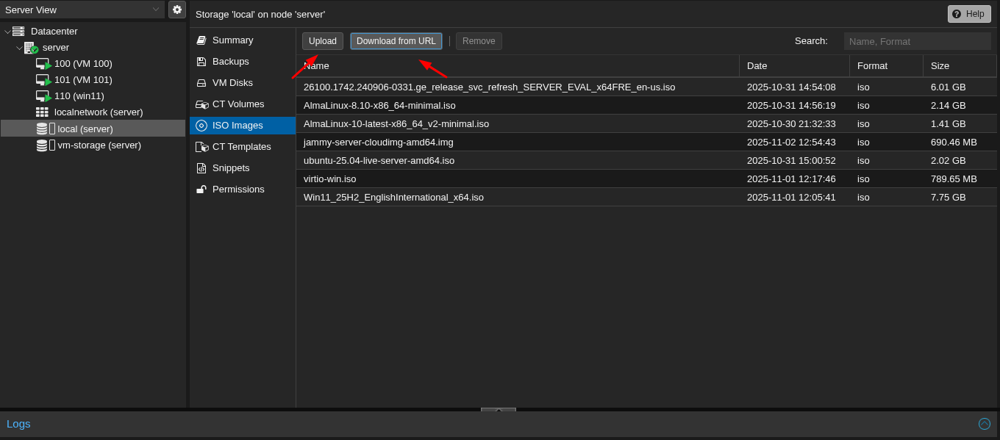

</details>

### Pastikan Storage Pool Tersedia

Masuk ke **Shell** melalui Web UI dan jalankan perintah berikut:

```bash
pvesm status
```

Pastikan ada storage bernama `vm-storage` (atau ganti sesuai konfigurasi kamu).

<details>
<summary>Klik untuk menampilkan</summary>


</details>

***

## ⚙️ Step 1 — Membuat VM Baru

Jalankan perintah berikut untuk membuat VM:

```bash
qm create 120 \
  --name ubuntu-server \
  --memory 4096 \
  --cores 4 \
  --cpu host \
  --machine pc-q35-9.2+pve1 \
  --bios ovmf \
  --ostype l26 \
  --net0 virtio,bridge=vmbr0 \
  --agent enabled=1
```
<details>
<summary>Klik untuk menampilkan</summary>

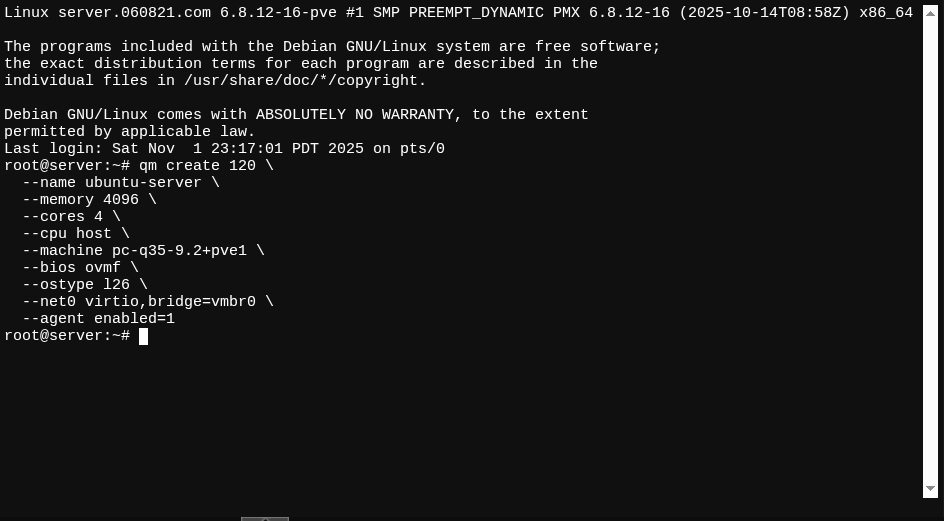

</details>

**Parameter:**

- `--name` — nama VM (misalnya: `ubuntu-server`)
- `--memory` — ukuran RAM dalam MiB (misalnya: `4096` untuk 4 GB)
- `--cores` — jumlah vCPU core (misalnya: `4`)
- `--cpu` — tipe CPU (misalnya: `host` untuk pass-through host CPU)
- `--machine` — tipe mesin virtual (misalnya: `pc-q35-9.2+pve1` untuk kompatibilitas Proxmox)
- `--bios` — tipe BIOS (misalnya: `ovmf` untuk UEFI, cocok dengan cloud-init)
- `--ostype` — tipe OS (misalnya: `l26` untuk Linux kernel 2.6+)
- `--net0` — konfigurasi jaringan (misalnya: `virtio,bridge=vmbr0` untuk NIC VirtIO pada bridge vmbr0)
- `--agent` — enable QEMU guest agent (misalnya: `enabled=1` untuk integrasi Proxmox)

**Catatan:** Perintah ini membuat VM tanpa disk awal. Disk akan ditambahkan pada Step 2 melalui import cloud image. Sesuaikan ID VM (120) agar unik.

***

## ⚙️ Step 2 — Tambahkan IMG

### Import IMG ke dalam VM

Lakukan import IMG menggunakan perintah berikut:

```bash
qm importdisk 120 /var/lib/vz/template/iso/jammy-server-cloudimg-amd64.img vm-storage
```
<details>
<summary>Klik untuk menampilkan</summary>

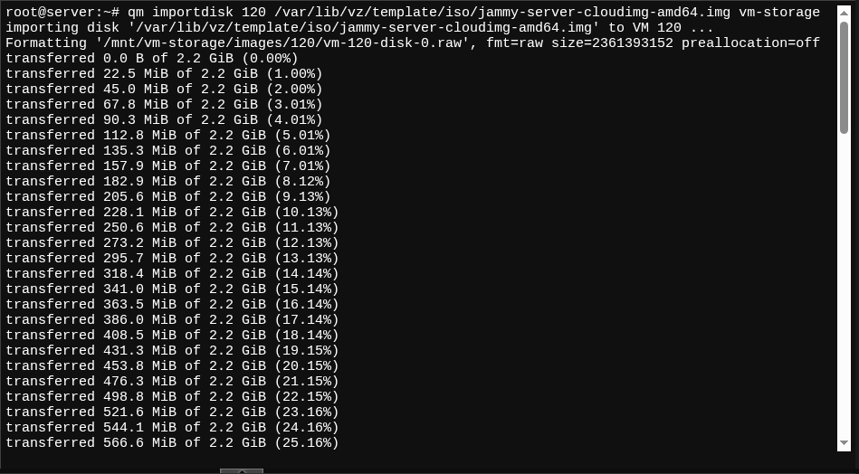

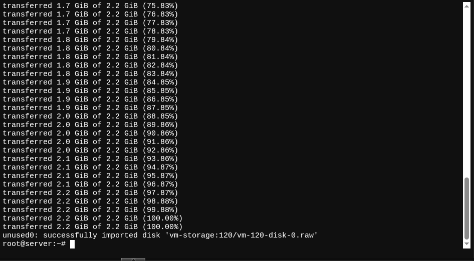

</details>

**Parameter:**

- `120` — ID VM (sesuaikan dengan ID VM yang dibuat di Step 1; harus unik di cluster Proxmox)
- `/var/lib/vz/template/iso/jammy-server-cloudimg-amd64.img` — path lengkap ke file source image (cloud image Ubuntu; pastikan file sudah di-upload ke direktori ISO Images via Web UI, yang biasanya disimpan di `/var/lib/vz/template/iso/`)
- `vm-storage` — nama target storage pool tempat disk akan diimpor (sesuai hasil `pvesm status`; ganti jika storage Anda berbeda, misalnya `local-lvm` atau `ssd-storage`)

**Catatan:** Perintah ini mengimpor image sebagai disk baru (biasanya dalam format raw atau qcow2) ke storage yang ditentukan. Jalankan dari shell Proxmox host. Jika path source salah, periksa lokasi file dengan `ls /var/lib/vz/template/iso/`. Setelah import, disk akan muncul sebagai unused di konfigurasi VM.

### Attach Disk ke VM

Setelah import selesai, attach disk ke VM:

```bash
qm set 120 --scsihw virtio-scsi-pci --scsi0 vm-storage:120/vm-120-disk-0.raw
```

<details>
<summary>Klik untuk menampilkan</summary>

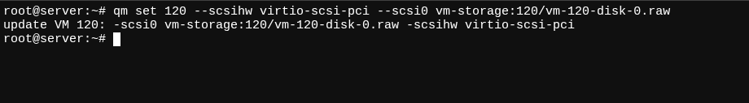

</details>

**Parameter:**

- `120` — ID VM (sesuaikan dengan ID VM yang dibuat sebelumnya; perintah ini mengonfigurasi VM tersebut)
- `--scsihw virtio-scsi-pci` — mengaktifkan controller SCSI berbasis VirtIO untuk performa optimal (direkomendasikan untuk disk cloud image; alternatif: `virtio-scsi-single` untuk single queue)
- `--scsi0` — slot bus untuk disk utama (scsi0 adalah slot pertama pada controller SCSI; bisa diganti ke ide0/sata0 jika menggunakan IDE/SATA, tapi SCSI lebih baik untuk Ubuntu cloud-init)

```
- `vm-storage:120/vm-120-disk-0.raw` — spesifikasi disk: `<storage>:<vmid>/<disk-filename>` (vm-storage adalah nama storage pool; 120 adalah ID VM; vm-120-disk-0.raw adalah nama file disk hasil import, biasanya di `/var/lib/vz/images/120/`; verifikasi nama file dengan `qm config 120` setelah import untuk memastikan)
```

**Catatan:** Jalankan perintah ini dari shell Proxmox host. Setelah attach, disk akan menjadi bootable. Jika nama disk berbeda (misalnya vm-120-disk-1.raw), sesuaikan. Periksa konfigurasi VM di Web UI untuk konfirmasi, dan start VM untuk menguji.

### Resize Disk (Opsional)

Sesuaikan ukuran disk sesuai kebutuhan:

```bash
qm resize 120 scsi0 +20G
```

<details>
<summary>Klik untuk menampilkan</summary>


</details>

**Parameter:**

- `120` — ID VM (sesuaikan dengan ID VM yang dibuat sebelumnya; perintah ini menargetkan VM tersebut)
- `scsi0` — identifikasi disk (slot bus disk yang di-attach sebelumnya, seperti scsi0 dari Step Attach; bisa diganti ke scsi1 jika disk tambahan)
- `+20G` — ukuran penyesuaian (tanda + untuk menambah ukuran; format: +<size>[suffix] di mana suffix bisa G (Gigabyte), T (Terabyte); ganti dengan nilai yang dibutuhkan, misalnya +10G untuk tambah 10 GB atau 50G untuk 50 GB)

**Catatan:** Perintah ini memperbesar disk secara non-destruktif (tidak menghapus data). Jalankan dari shell Proxmox host. Setelah resize, start VM dan expand partisi/filesystem di dalam Ubuntu (misalnya: `sudo growpart /dev/sda 1` lalu `sudo resize2fs /dev/sda1` untuk ext4). Hindari ukuran negatif (-) kecuali untuk shrink, yang berisiko kehilangan data—backup dulu jika perlu. Verifikasi ukuran baru dengan `qm config 120`.

***

## ⚙️ Step 4 — Membuat Template (Skip Cloud-Init Konfigurasi Awal)

Ubuntu cloud image sudah include cloud-init dasar yang siap pakai, jadi VM akan boot ke user default 'ubuntu' (via console tanpa password awal atau serial console untuk akses). Konversi ke template dulu, lalu konfigurasi cloud-init dilakukan setelah clone template ke VM baru (lebih fleksibel untuk kustomisasi per VM). Alur ini fokus pada boot order minimal, tambah cloud-init drive dasar (untuk support injeksi config nanti), test boot, dan convert template.

### 4.1 Tambahkan Cloud-Init Drive Dasar

Tambahkan drive CD-ROM virtual minimal untuk cloud-init, tanpa konfigurasi detail (hanya untuk enable support injeksi config saat clone nanti).

Jalankan perintah berikut:

```bash
qm set 120 --ide2 vm-storage:cloudinit
```

<details>
<summary>Klik untuk menampilkan</summary>

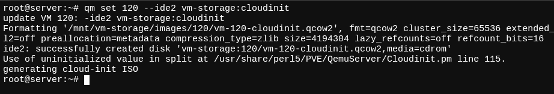

</details>

**Parameter:**

- `120` — ID VM target.
- `--ide2 vm-storage:cloudinit` — Slot ide2 untuk cloud-init (ganti `vm-storage` dengan storage pool Anda dari `pvesm status`, seperti `local-lvm`; ini buat ISO virtual kecil untuk config injeksi, tanpa set user/password).

**Catatan:** Jika storage tidak support, gunakan `local-lvm:cloudinit` sebagai default. Skip ini jika ingin pure tanpa cloud-init; tapi direkomendasikan untuk kemudahan clone dengan auto-config. Drive bisa di-update otomatis saat clone.

### 4.2 Atur Boot Order

Atur urutan boot agar VM prioritas ke disk Ubuntu (scsi0) terlebih dahulu, diikuti cloud-init drive (ide2) untuk potensi konfigurasi injeksi saat clone.

Jalankan perintah berikut (sesuaikan ID VM dari 120):

```bash
qm set 120 --boot order="scsi0;ide2"
```
<details>
<summary>Klik untuk menampilkan</summary>

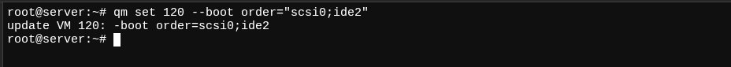

</details>

**Parameter:**

- `120` — ID VM yang sudah dikonfigurasi sebelumnya (verifikasi dengan `qm list`).
- `--boot order="scsi0;ide2"` — Urutan boot: scsi0 (disk utama Ubuntu) pertama, ide2 (cloud-init drive) kedua (tambah ;net0 jika perlu network boot, tapi cukup ini untuk template dasar).

**Catatan:** Jalankan dari shell Proxmox host. Verifikasi dengan `qm config 120 | grep boot`—harus tampil `boot: order=scsi0;ide2`.

### 4.3 Convert VM ke Template

Konversi VM menjadi template, dengan cloud-init drive dasar untuk konfigurasi pasca-clone.

Jalankan perintah berikut (VM harus stopped):

```bash
qm template 120
```

<details>
<summary>Klik untuk menampilkan</summary>

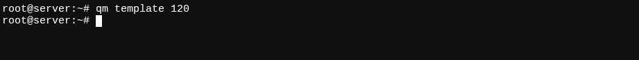

</details>

**Parameter:**

- `120` — ID VM yang akan dikonversi.

**Catatan:** VM sekarang jadi template di Web UI (tanda "Template"). Clone via `qm clone 120 150 --name new-vm` atau Web UI (pilih Full Clone). Template hemat space via snapshot saat clone. Backup config: `cp /etc/pve/qemu-server/120.conf /backup/` sebelum convert.

***

## ⚙️ Step 5 — Konfigurasi Cloud-Init Setelah Template Selesai Dibuat

Setelah template jadi kita clone template ke VM baru (misalnya ID 150), tambahkan konfigurasi cloud-init pada VM tersebut sebelum start—ini memungkinkan custom user, password, network, SSH keys per VM tanpa ubah template.

1. Clone dulu:

```bash
qm clone 120 150 --name ubuntu-clone --full 1  # Full clone untuk independen
```

<details>
<summary>Klik untuk menampilkan</summary>

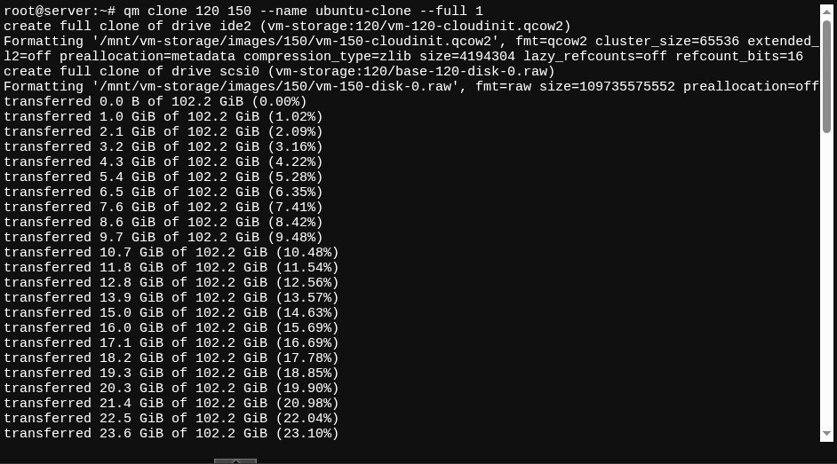

</details>

2. Set konfigurasi cloud-init pada VM clone:

```bash
qm set 150 --ciuser ubuntu --cipassword 'yourpassword' --sshkeys /root/.ssh/id_rsa.pub --ipconfig0 ip=192.168.1.100/24,gw=192.168.1.1 --nameserver 1.1.1.1
qm cloudinit update 150  # Regenerate ISO cloud-init
```

<details>
<summary>Klik untuk menampilkan</summary>

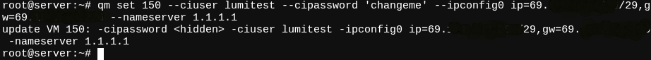
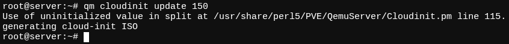

</details>

**Parameter:**

- `150` — ID VM clone baru.
- `--ciuser ubuntu` — Username login (standar).
- `--cipassword 'yourpassword'` — Password (ganti aman; opsional, hilangkan untuk SSH-only).
- `--sshkeys /root/.ssh/id_rsa.pub` — Path public SSH key (generate dengan `ssh-keygen` jika perlu).
- `--ipconfig0 ip=192.168.1.100/24,gw=192.168.1.1` — Network config (ipconfig0 untuk net0; gunakan dhcp untuk auto, atau statis; sesuaikan subnet).
- `--nameserver 1.1.1.1` — Pengaturan DNS.
- `qm cloudinit update 150` — Update drive dengan config baru.

**Catatan:** Jalankan sebelum `qm start 150`. Konfig ini per VM clone, tidak ubah template. Verifikasi dengan `qm cloudinit dump 150`. Di Web UI: Clone > Cloud-Init tab untuk set via GUI (Regenerate Image). Setelah start, login dengan user/password baru, dan cloud-init jalankan auto-setup (network, hostname, etc.). Jika skip cloud-init total, config manual di VM clone via console.

***

## ⚙️ Step 6 — Jalankan VM

Setelah konfigurasi cloud-init selesai (user, password, network, dan update ISO), start VM untuk mengaktifkan Ubuntu cloud image dengan auto-setup via cloud-init. VM akan boot otomatis, apply IP statis (jika diset), dan siap login via console atau SSH setelah cloud-init inisialisasi (1-2 menit).

### 🔹 Melalui WebUI

1. Login ke Proxmox Web UI (https://your-proxmox-ip:8006).
2. Pilih VM (misalnya ID 150) di sidebar kiri.
3. Klik tombol **Start** di panel atas (ikon play), atau pilih **Shutdown** > **Start** jika VM stopped.
4. Tunggu status berubah ke "running" (hijau di console indicator).
5. Akses console: Klik **Console** > **noVNC** untuk view terminal VM (login dengan user `ubuntu` dan password `yourpassword`).

**Catatan:** Jika boot lambat, refresh halaman atau cek log VM di **Summary** tab. Pastikan resource host cukup (RAM/CPU alokasi).

<details>
<summary>Klik untuk menampilkan</summary>

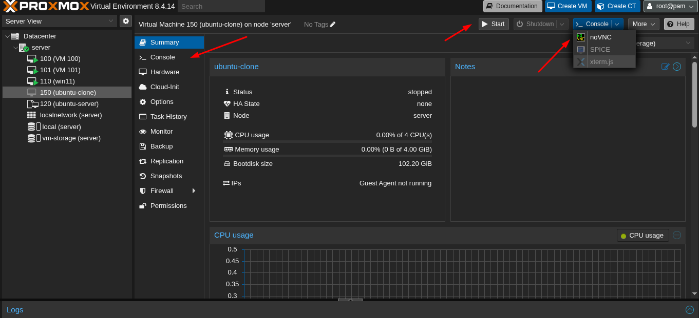

</details>

### 🔹 Melalui Shell

Jalankan perintah dari shell Proxmox host (Web UI > Shell atau SSH ke host).

```bash
qm start 150
```

<details>
<summary>Klik untuk menampilkan</summary>

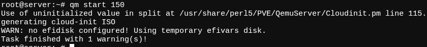

</details>

**Parameter:**

- `150` — ID VM clone yang dikonfigurasi (verifikasi dengan `qm list`; ganti jika ID berbeda).
- `qm start 150` — Start VM secara non-blocking (VM akan boot di background; gunakan `qm status 150` untuk cek progress: status `running` saat siap).

**Catatan:** Jika VM sudah running, gunakan `qm stop 150` dulu (graceful shutdown). Untuk force stop: `qm stop 150 --skiplock 1`. Jalankan `qm monitor 150` untuk CLI access (ketik `quit` untuk keluar).

## 🚀 Langkah Selanjutnya

Setelah VM berhasil dibuat dan dijalankan, verifikasi konfigurasi cloud-init di dalam guest OS Ubuntu, akses VM untuk setup tambahan, dan troubleshoot jika diperlukan. Ini memastikan VM siap untuk produksi atau ekspansi (misalnya install software, configure services).

### 6.1 Akses dan Verifikasi VM

1. **Console Access:** Dari Web UI Console atau `qm agent 150 ping` (jika guest agent enabled), login sebagai `ubuntu` dengan password `yourpassword`. Jalankan perintah berikut di VM untuk verifikasi:

```bash
whoami  # Output: ubuntu
ip addr show  # Cek IP: 192.168.1.100/24 pada interface ens160 atau serupa
ip route show  # Cek default gateway: via 192.168.1.101
cat /etc/resolv.conf  # Cek DNS: nameserver 1.1.1.1
ping -c 3 1.1.1.1  # Test connectivity (jika gagal, cek host firewall)
cloud-init status --wait  # Pastikan cloud-init selesai (status: done)
```

**Catatan:** Jika SSH key di-set, akses via SSH: `ssh ubuntu@192.168.1.100` dari host eksternal (pastikan port 22 terbuka di Proxmox firewall: Web UI > Datacenter > Firewall).
2. **Test Network dan SSH:** Dari host Proxmox atau mesin lain, test:

```bash
ssh ubuntu@192.168.1.100 # Login via SSH (password atau key)
ping google.com  # Dari VM: Test DNS resolution
```

**Catatan:** Karena IP yang dikonfigurasi adalah IP public (contoh: 69.xxx.xxx.xxx/29 dengan gateway 69.xxx.xxx.xxx pada screenshot), akses eksternal memerlukan konfigurasi tambahan di sisi provider atau router untuk forward traffic. Jika DHCP diperlukan nanti, edit template dengan `--ipconfig0 dhcp` dan regenerate.

### 6.2 Setup Tambahan di VM

- **Update Sistem:** Di VM console/SSH:

```bash
sudo apt update && sudo apt upgrade -y
sudo apt install openssh-server -y  # Jika belum ada
sudo apt install qemu-guest-agent # Wajib
sudo systemctl start qemu-guest-agent
sudo systemctl enable qemu-guest-agent
sudo reboot  # Reboot untuk apply
```

**Catatan:** Ini standar post-boot; sesuaikan dengan kebutuhan (misalnya install Docker, Nginx untuk server).
- **Persistensi Config:** Cloud-init config (IP, user) apply sekali boot; untuk perubahan permanen, edit `/etc/netplan/50-cloud-init.yaml` lalu `sudo netplan apply`. Hindari edit langsung template—clone VM baru untuk variasi.


### 6.3 Troubleshooting Umum

- **Boot Gagal/Black Screen:** Cek `qm status 150` (jika paused, `qm resume 150`). Lihat log: `journalctl -u pve-cluster` di host atau `dmesg` di VM console.
- **IP Tidak Apply:** Jalankan `qm cloudinit update 150` lagi, restart VM (`qm reboot 150`). Cek `/var/log/cloud-init.log` di VM untuk error.
- **No Network:** Verifikasi bridge vmbr0 di host (`ip addr show vmbr0`), dan firewall rule (allow TCP/UDP untuk port VM). Jika VLAN, tambah tag di `--net0`.
- **DNS Gagal:** Di VM, `sudo systemctl restart systemd-resolved`. Jika persist, tambah `--searchdomain yourdomain.com` di qm set (opsional).
- **Error Cloud-Init:** `qm cloudinit dump 150` untuk debug config. Jika schema issue, pisah perintah qm set (satu parameter per run).

**Catatan Keseluruhan:** VM sekarang siap gunakan. Untuk skala, clone template lebih banyak (misalnya `qm clone 120 160 --full 1`) dan customize per VM. Monitor via Proxmox UI > VM > Summary (CPU/RAM usage). Backup VM dengan `vzdump 150 --mode snapshot` untuk safety. Jika ingin disable password auth post-setup, edit `/etc/ssh/sshd_config` di VM dan restart SSH.

***