# Panduan Instalasi Windows 11 di Proxmox

Dokumentasi ini menjelaskan langkah-langkah instalasi Windows 11 pada VM Proxmox, mulai dari persiapan media boot, konfigurasi instalasi, hingga instalasi driver.

---

## 1. Persiapan Media Boot

1. **Tekan tombol saat console sedang loading** untuk melakukan boot dari **CD/DVD**.  
   

2. **Jika terlambat**, akan masuk ke **Boot Management**.  
   Pilih **Boot Manager**, lalu tekan **Enter**.  
   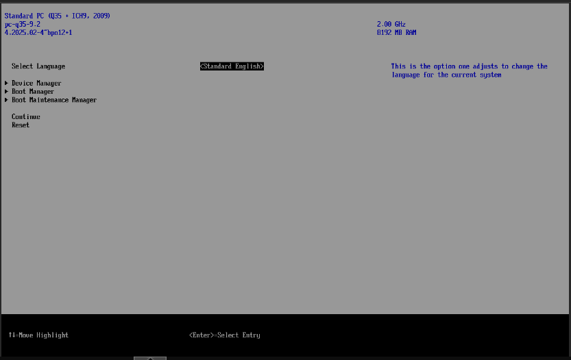

3. Setelah masuk, **tekan Enter** untuk memulai booting dari **CD/DVD**.  
   Pastikan untuk menekan **Enter** kembali jika muncul tampilan seperti langkah 1.  
   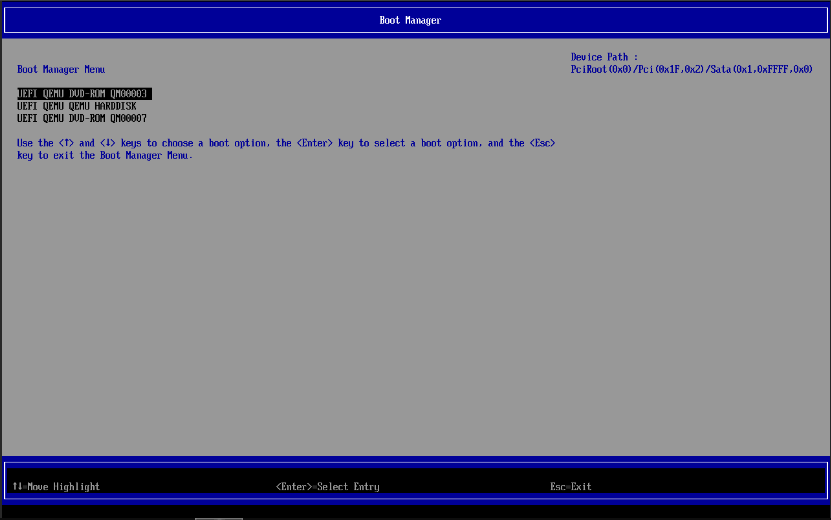

4. Jika berhasil, Anda akan melihat tampilan instalasi Windows 11 berikut:  
   

---

## 2. Pengaturan Awal Instalasi

1. **Pilih bahasa, format waktu, dan pengaturan regional** sesuai kebutuhan.  
   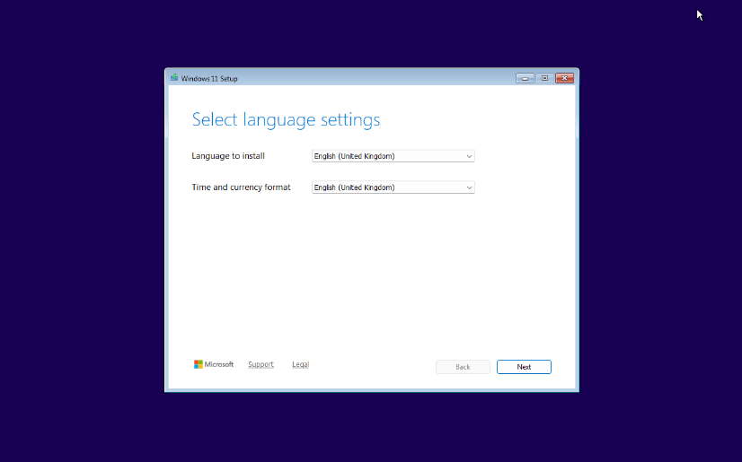

2. **Atur pengaturan keyboard** sesuai preferensi Anda.  
   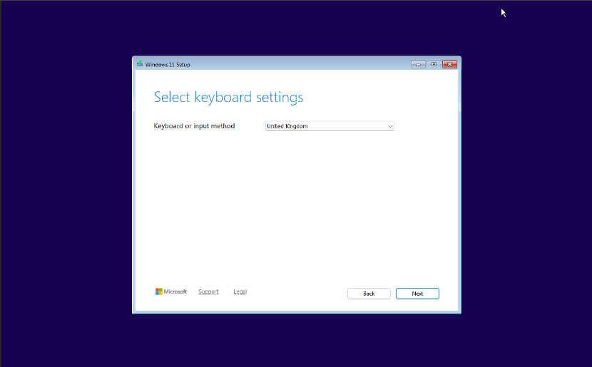

3. Pilih **Install Windows 11**.  
   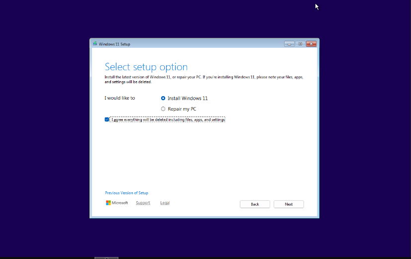

4. Pilih **ISO Windows 11** yang ingin diinstal (dalam contoh ini menggunakan versi PRO).  
   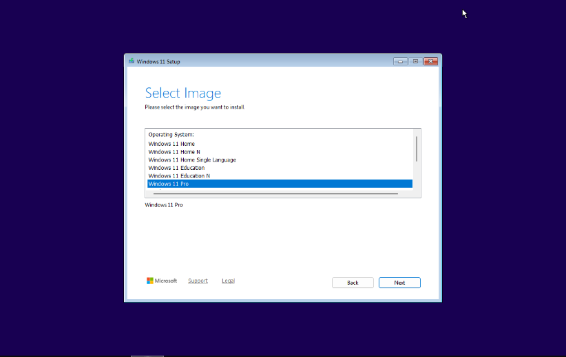

5. **Setujui perjanjian lisensi Windows 11**.  
   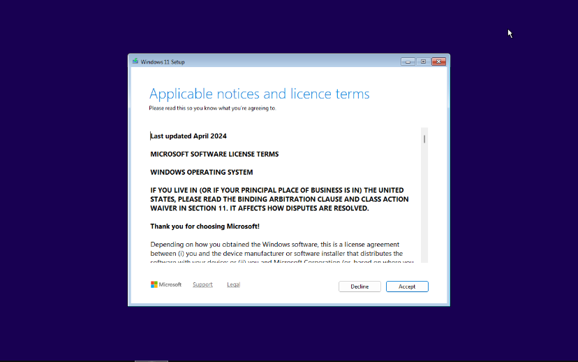

---

## 3. Instalasi Driver

1. Jika disk kosong muncul, pilih **Load Driver**.  
   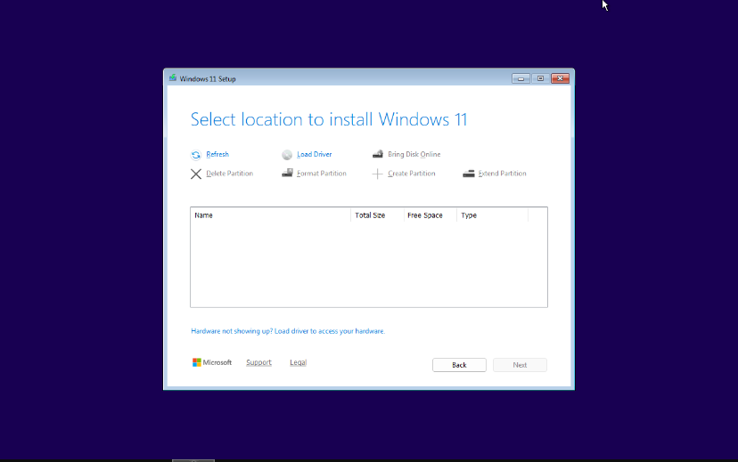

2. Pilih **Browse**.  
   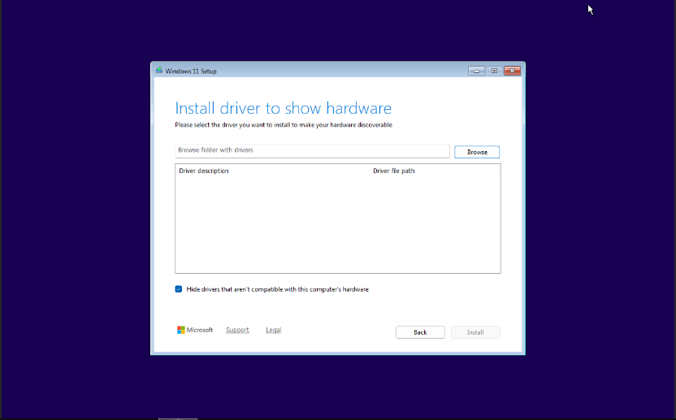

3. Cari **CD Drive VirtIO**, lalu pilih folder **amd64**.  
   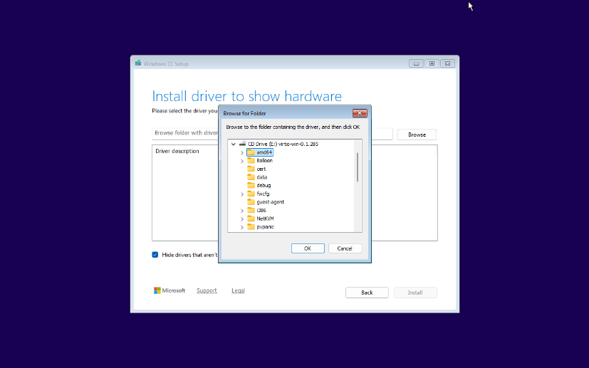

4. Pilih folder **w11**, lalu klik **Ok**.  
   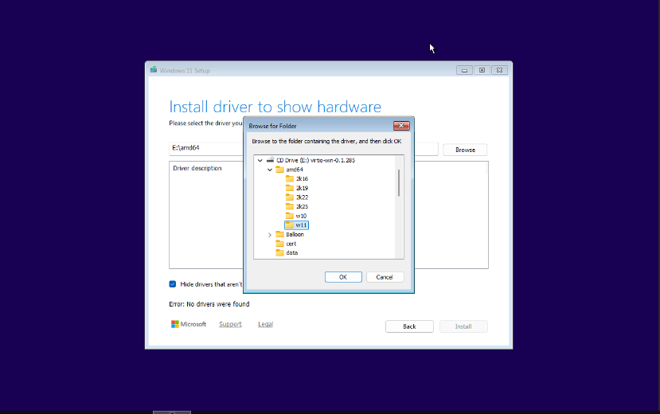

5. Driver akan muncul seperti pada gambar, pilih driver tersebut lalu klik **Install**.  
   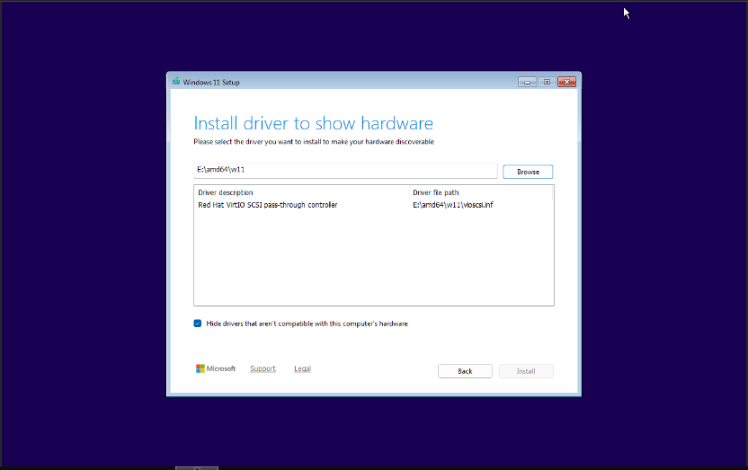  
   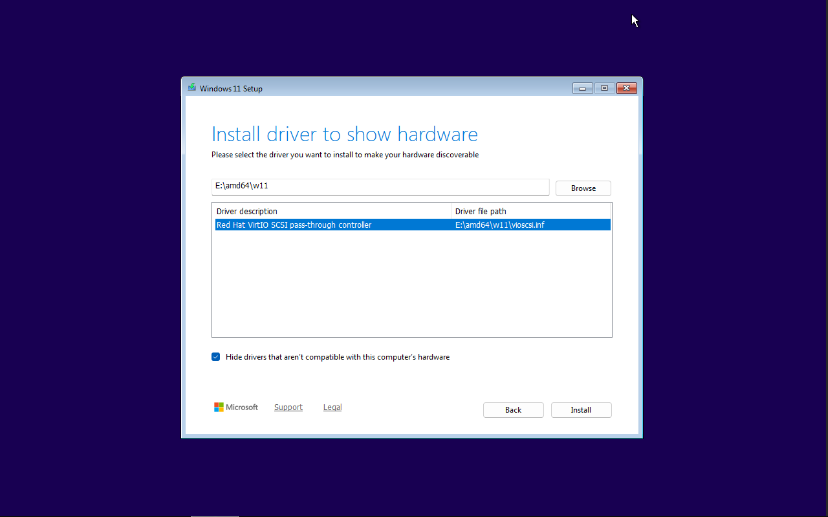

---

## 4. Partisi dan Instalasi Windows

1. Setelah driver terdeteksi, disk akan muncul.  
   Anda bisa membuat partisi sesuai kebutuhan, namun pada contoh ini partisi di-skip.  
   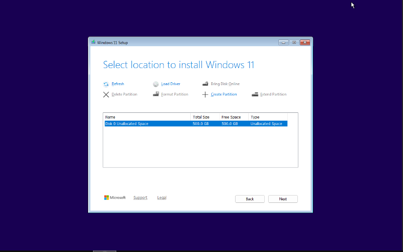

2. Pada jendela **Ready to Install**, klik **Install** untuk memulai proses instalasi.  
   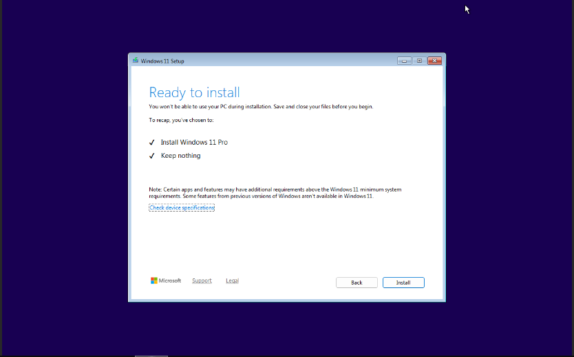

3. Tunggu hingga proses instalasi selesai. Sistem akan **reboot otomatis**.  
   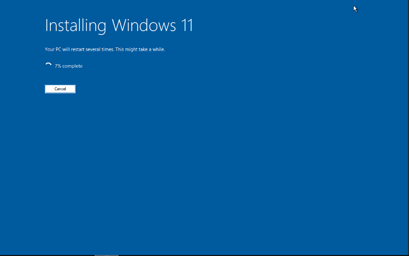

4. Saat reboot, **jangan menekan tombol apapun** agar sistem dapat booting ke hard disk.  
   Biarkan sementara sebelum CD/DVD ROM di-detach dari VM.  
   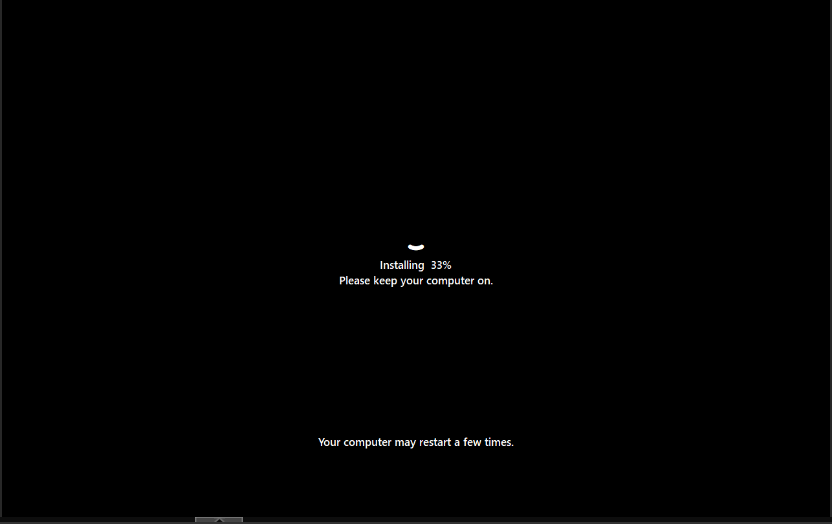

---

## 5. Langkah Selanjutnya

- Setelah instalasi selesai, sistem akan boot ke Windows 11.  
➡️ [**Buka Panduan Konfigurasi Windows 11**](./konfigurasi.md)
