# Panduan Konfigurasi Windows 11 di Proxmox

Dokumentasi ini menjelaskan langkah-langkah konfigurasi Windows 11 setelah instalasi pada VM Proxmox, mulai dari pengaturan dasar, instalasi driver tambahan, hingga optimasi VM.

---

## 1. Pengaturan Awal Windows 11

1. **Login pertama kali** setelah instalasi.
   
   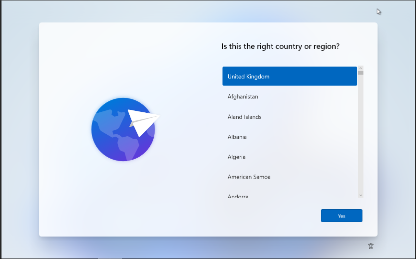

2. **Cek dan sesuaikan pengaturan regional dan keyboard**.
    - disini saya memili region Indonesia lalu keyboard seperti gambar dibawah        
        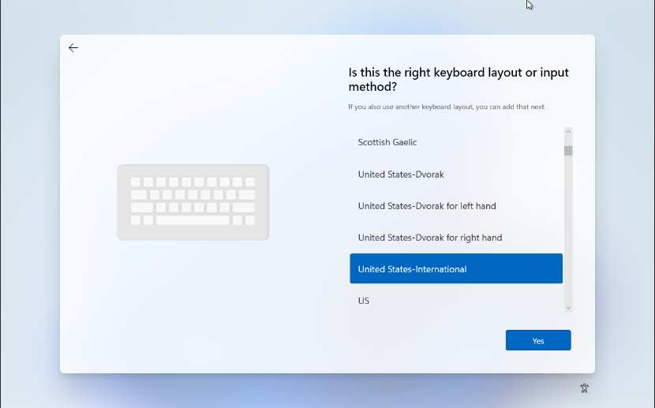

    - (optional) disini saya skip
       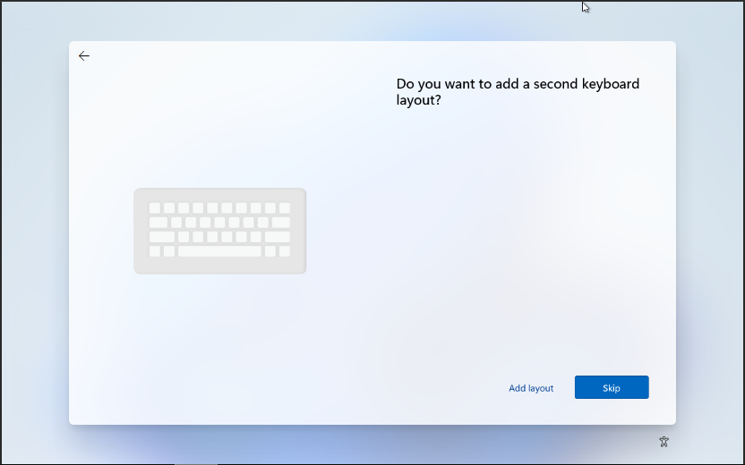    

---

## 2. Instalasi Driver dan Tools VM

1. **Saat muncul layar “Let’s connect you to a network”**, lakukan langkah berikut:

   - Tekan kombinasi tombol:  
     ```text
     Shift + F10
     ```
     → Akan terbuka **Command Prompt**.  
     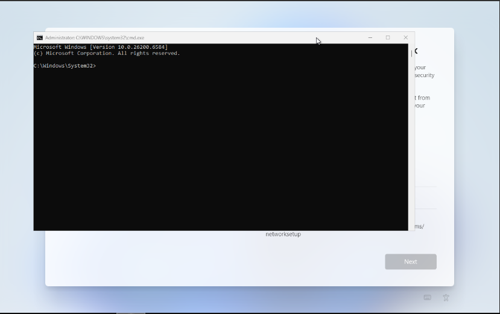

   - Klik **File > Open**, lalu cari **CD-ROM VirtIO**.  
     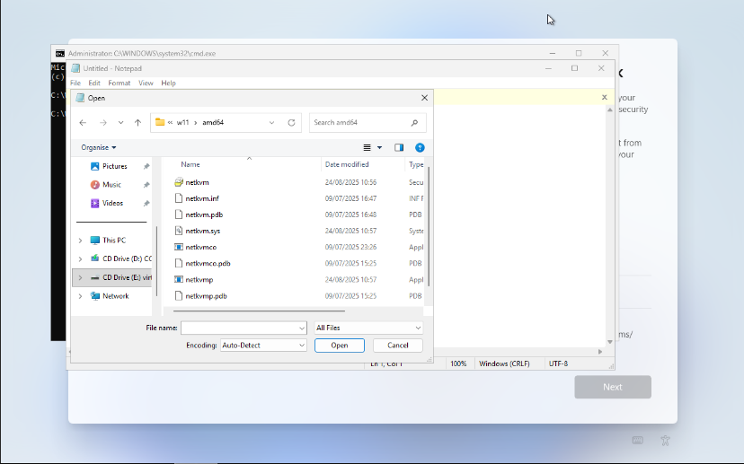

   - Masuk ke folder:
     ```text
     NetKVM > w11 > amd64
     ```
     → Pastikan ada file `.inf` seperti `netkvm.inf`.  
     Klik kanan file `.inf` → **Install**.  
     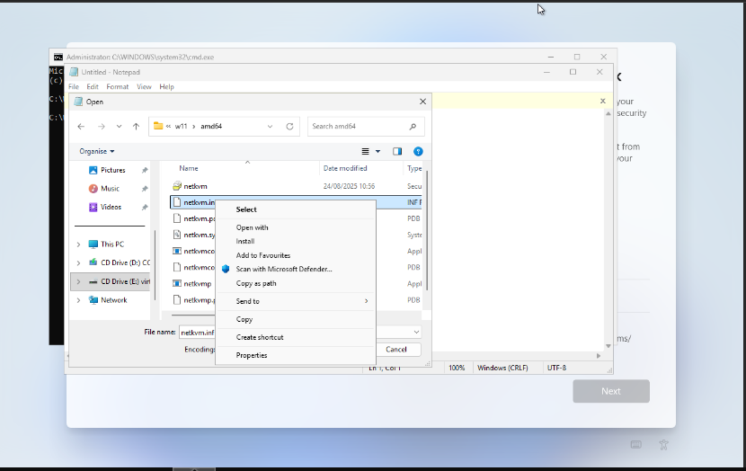

   - Tutup semua jendela, kemudian buka kembali **Command Prompt**.  
     Jika masih terbuka, lewati langkah ini.  
     

   - Pada **Command Prompt**, jalankan perintah berikut:  
     ```text
     oobe\bypassnro
     ```
     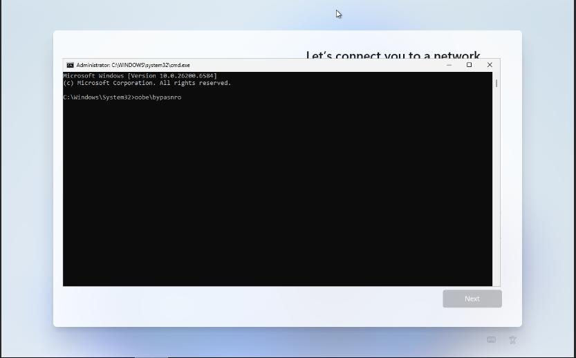

     → VM akan reboot otomatis dan setelah kita akan menggulang dari awal namun disini opsi 
     “I don’t have internet” akan muncul. 
    
    - Pilih “I don’t have internet”
     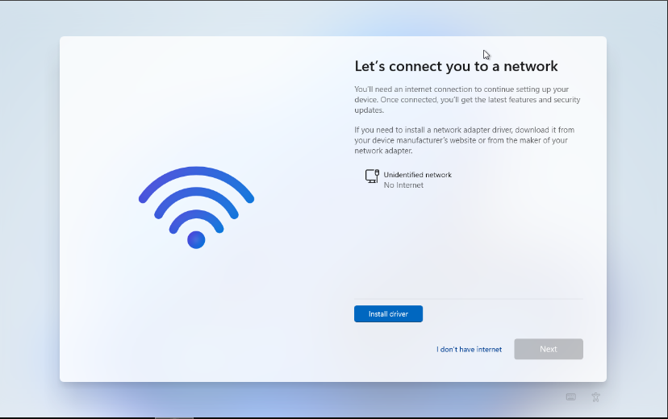

## 3. Pengaturan Setelah Instalasi Driver

1. **Setelah melewati layar “Let’s connect you to a network”**, lanjutkan langkah berikut:

   - Buat **Username** untuk akun Windows.
   - Atur **Password** dan lakukan **konfirmasi Password**.
   - Tentukan **Kata Kunci Keamanan** (Security Key) jika diminta.
   - Atur pengaturan **Privacy** sesuai preferensi.

> Setelah menyelesaikan pengaturan ini, VM akan melakukan **reboot otomatis**.

---

## 4. Jaringan dan Keamanan

1. **Mengatur koneksi jaringan** agar VM dapat mengakses internet.  
   Langkah-langkah:

   1. Buka **Start → Settings → Network & Internet**.  
   2. Pilih **Ethernet** (biasanya tertulis “Ethernet” karena menggunakan VirtIO NIC).
   3. Klik **Edit** pada bagian **IP assignment**, 
        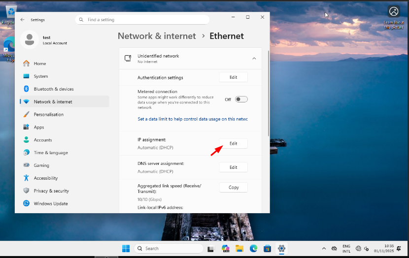

   4. bah dari **Automatic (DHCP)** ke **Manual**.  
        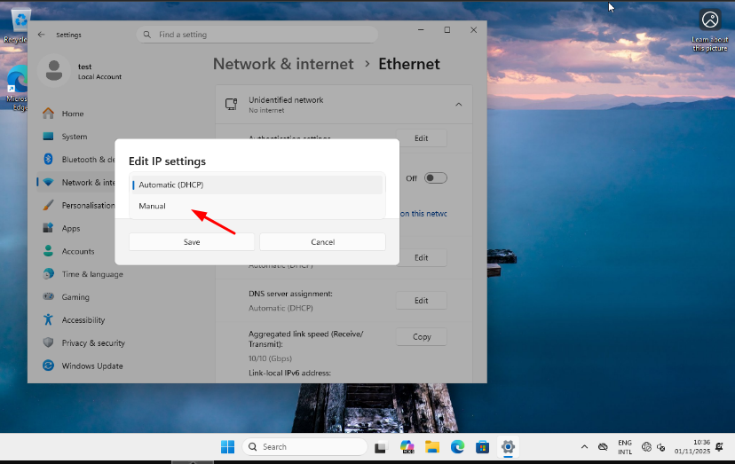

   4. Aktifkan **IPv4**, lalu isi informasi berikut:
         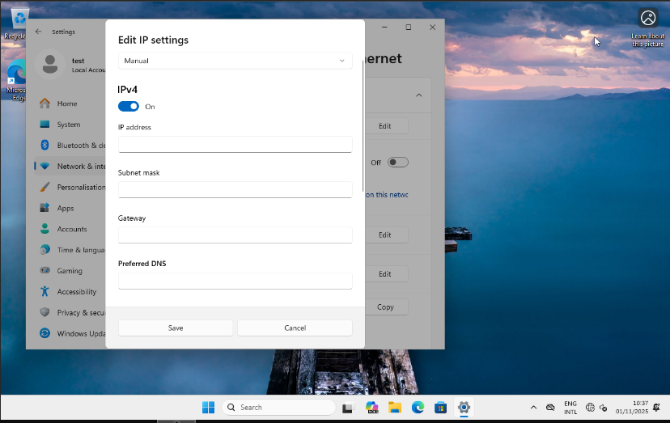

      - **IP address:** 29.164.250.114 (contoh)  
      - **Subnet prefix length:** 29 (contoh)  
      - **Gateway:** 29.164.248.216 (contoh)  
      - **Preferred DNS:** 1.1.1.1 (contoh)  
      - **Alternate DNS:** 8.8.8.8 (contoh)  

   5. Klik **Save**, kemudian restart koneksi atau reboot VM agar pengaturan diterapkan.

## 5. Mengaktifkan Remote Desktop (RDP)

1. **Buka Settings**  
   Klik **Start → Settings → System → Remote Desktop**.

2. **Aktifkan Remote Desktop**  
   - Nyalakan opsi **Remote Desktop**.  
   - Jika muncul konfirmasi, klik **Confirm**.
     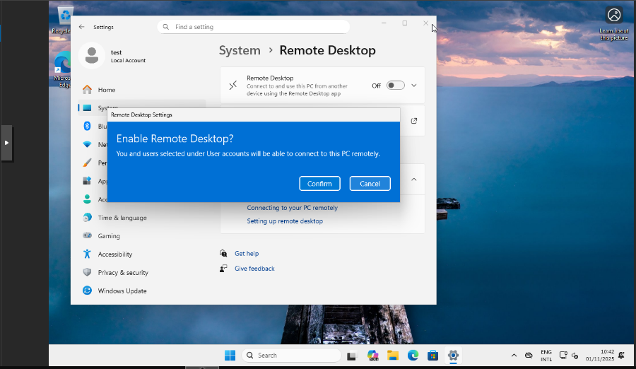

3. **Catat Nama PC atau IP Address VM**  
   - Nama PC dapat dilihat di bagian **PC name**.  
   - Pastikan IP address VM sudah dikonfigurasi (lihat langkah Jaringan sebelumnya).
     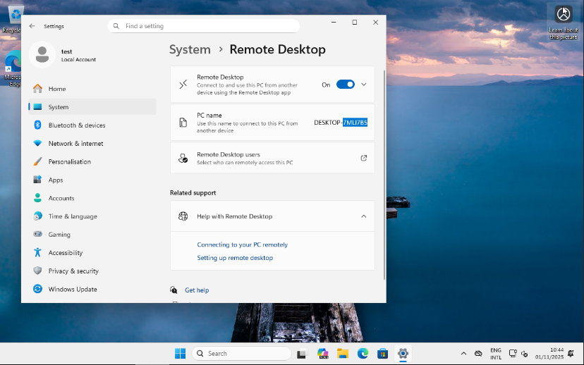

4. **Atur Firewall (opsional)**  
   - Pastikan port **3389** (RDP default) dibuka di firewall Windows:  
     - Buka **Start → Windows Security → Firewall & network protection → Allow an app through firewall**.  
     - Centang **Remote Desktop** untuk jaringan Private/Domain.  

5. **Akses VM dari Host atau Client**  
   - Buka aplikasi **Remote Desktop Connection (mstsc)** di komputer host.  
   - Masukkan **IP address atau PC name** VM, lalu klik **Connect**.  
   - Masukkan username dan password akun Windows VM.

6. **Tips Tambahan**  
   - Jika menggunakan Proxmox NAT atau bridged network, pastikan port **3389** dapat diakses dari jaringan host/client.  
   - Untuk keamanan, gunakan VPN atau ganti port default RDP jika VM akan diakses dari jaringan publik.

---
## 6. (OPSIONAL) Instalasi Qemu Guest Agent

1. **Buka File Explorer → CD-ROM VirtIO.**
2. **Masuk Ke Folder → guest-agent.**
3. **Pilih file qemu_ga_x86_64 → Klik kanan → Install.**
4. **Ikuti wizard instalasi hingga selesai.**
5. **Setelah instalasi, restart VM**

## 7. Merubah BOOT Order

Agar tidak meload ISO Windows Mari Kita **rubah Boot Order** dari VM:
→ Jalankan Perintah ini di Shell
```text
qm set 110 --boot "order=scsi0
```

→ Setelah itu kita reboot VM kita.

## 8. Langkah Selanjutnya

- Windows 11 VM sudah siap digunakan.
- Lanjutkan dengan instalasi aplikasi atau software yang dibutuhkan.


