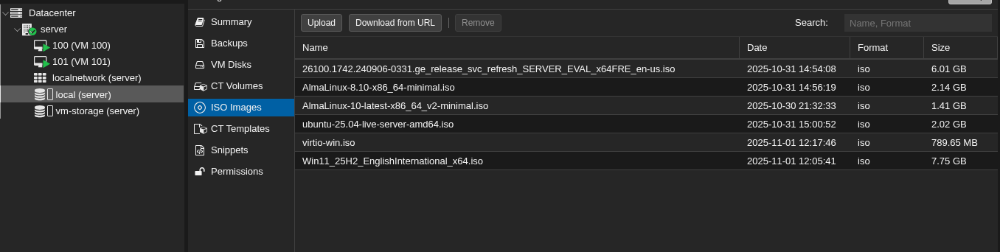
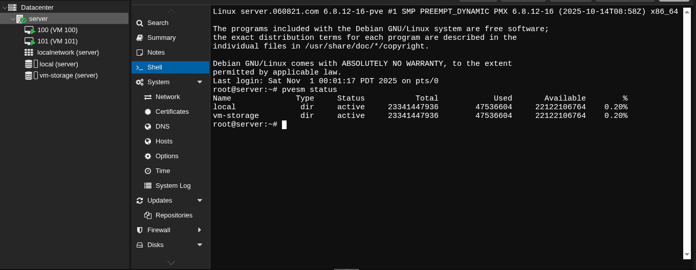
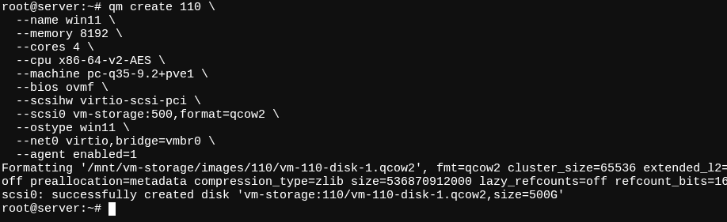
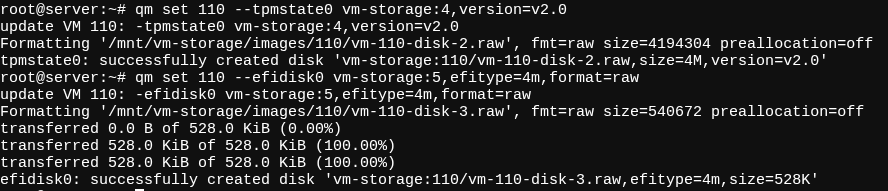
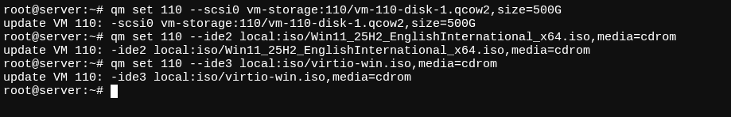
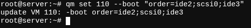
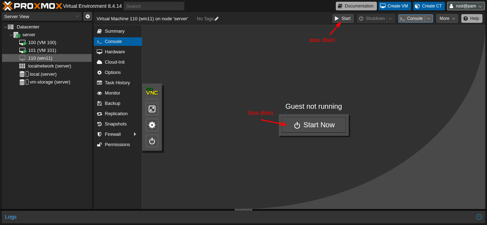
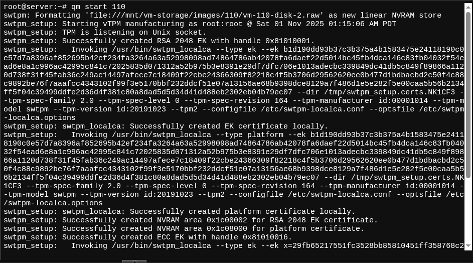

# 🪟 Install Windows 11 on Proxmox VE 8.1.4 (OVMF + VirtIO)

## 📘 Panduan Lengkap

---

## ⚙️ Persiapan

### 1. Upload atau Download File ISO ke Proxmox

- **Windows 11 ISO:** `Win11_25H2_EnglishInternational_x64.iso`  
- **VirtIO Driver ISO:** `virtio-win.iso`  
- Upload / Download kedua file ke: **local → ISO Images**

Lihat Screenshot Ini  

<details>
<summary>Klik untuk menampilkan</summary>



</details>

---

### 2. Pastikan Storage Pool Tersedia

- Masuk ke **Shell** melalui Web UI.
- Jalankan perintah berikut:

```bash
pvesm status
```

- Pastikan ada storage bernama `vm-storage`  
  (atau ganti sesuai konfigurasi kamu).

Lihat Screenshot Ini  

<details>
<summary>Klik untuk menampilkan</summary>



</details>

---

## ⚙️ Step 1 — Membuat VM Baru

```bash
qm create 110 \
  --name win11 \
  --memory 8192 \
  --cores 4 \
  --cpu x86-64-v2-AES \
  --machine pc-q35-9.2+pve1 \
  --bios ovmf \
  --scsihw virtio-scsi-pci \
  --scsi0 vm-storage:500,format=qcow2 \
  --ostype win11 \
  --net0 virtio,bridge=vmbr0 \
  --agent enabled=1
```

**Catatan:**  
- `memory` → ukuran RAM dalam MiB  
- `cores` → jumlah vCPU core  
- `scsi0` → lokasi disk (`vm-storage:500` = folder + ukuran dalam GB)

Lihat Screenshot Ini  

<details>
<summary>Klik untuk menampilkan</summary>



</details>

---

## ⚙️ Step 2 — Tambahkan TPM State & EFI Disk

```bash
qm set 110 --tpmstate0 vm-storage:4,version=v2.0
qm set 110 --efidisk0 vm-storage:5,efitype=4m,format=raw
```

Lihat Screenshot Ini  

<details>
<summary>Klik untuk menampilkan</summary>



</details>

---

## ⚙️ Step 3 — Tambahkan Disk & ISO

```bash
qm set 110 --scsi0 vm-storage:110/vm-110-disk-1.qcow2,size=500G
qm set 110 --ide2 local:iso/Win11_25H2_EnglishInternational_x64.iso,media=cdrom
qm set 110 --ide3 local:iso/virtio-win.iso,media=cdrom
```

Lihat Screenshot Ini  

<details>
<summary>Klik untuk menampilkan</summary>



</details>

---

## ⚙️ Step 4 — Atur Urutan Boot

```bash
qm set 110 --boot "order=ide2;scsi0;ide3"
```

Lihat Screenshot Ini  

<details>
<summary>Klik untuk menampilkan</summary>



</details>

---

## ⚙️ Step 5 — Jalankan VM

### 🔹 Melalui WebUI

Lihat Screenshot Ini  

<details>
<summary>Klik untuk menampilkan</summary>



</details>

### 🔹 Melalui Shell

```bash
qm start 110
```

Lihat Screenshot Ini  

<details>
<summary>Klik untuk menampilkan</summary>



</details>

---

## 🚀 Langkah Selanjutnya

Setelah VM berhasil dibuat dan dijalankan, lanjut ke tahap instalasi sistem operasi:

➡️ [**Buka Panduan Instalasi Windows 11**](./install.md)
